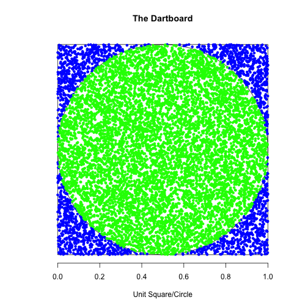

Monte Carlo simulation to estimate Pi
========================================================
author: Jamin Ragle 
date: Sunday, July 26th, 2015

### Summary
Monte Carlo simulations are a tool that use random numbers to simulate various statistical outcomes. In this case we will attempt to estimate the number **pi** (3.1415927...). The following is a outline how this is done.

Monte Carlo simulation to estimate Pi
========================================================

### The Challenge!


Imagine if you will that you are playing a game of darts with your friend. The dartboard is hanging on a square piece of wood cut with the same diameter. Your friend boasts that they bet they could calculate the number **pi** by throwing darts randomly at the dartbard. 

You are not sure you believe them, but decide to take them up on the challenge!

***

 

```
[1] 3.08
```

Throwing the darts!
========================================================

#### Lots of darts where thrown!
 

```
[1] 3.1516
```
***
### Like 30,000 darts!
 

```
[1] 3.149867
```

Relationship of areas: circle and square
========================================================

You notice in the flurry of darts being thrown that your friend has been counting how many darts hit the inside of the circle, verses the outside. He keeps saying numbers that sound close to **pi**. You think you understand what the game is.

Lets look at the relationship of the **unit circle** and **unit square**. We start the familiar example of finding the area of a circle, which is `pi*r^2`. Similarly the area of the square is defined as `2*r^2`. 

***

The ratio of the area of the circle to the area of the square is:


```r
area_cr = pi*r^2
area_sq = 2*r^2

# The ratio of areas
p = area_cr/area_sq 
  = (pi*r^2)/(2*r^2)
  = pi/4
```


```
[1] 0.7853982
```

If we multiply that constant by 4, we just get **pi**, 3.1415927. 

More on Calculating the estimate of pi 
========================================================

As you can see from the previous slide the radius for a unit square and a circle cancel the term out always leaving the area inside to the outside of the circle a constant ratio `pi/4` which is 0.7853982. 

Another interesting to note, **Accuracy** of estimating **pi** goes up for large values of `N`. This is how our friend can caculate an estimate of **pi**. The more darts our friend throws, the closer we get to the actual value of **pi**.

***

 

The Shiny app you can throw darts yourself! https://zombieprocess.shinyapps.io/pi-monte-carlo
